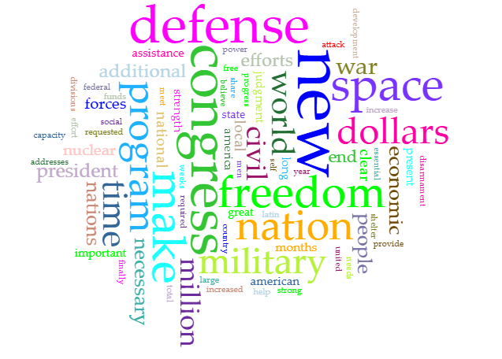



# Distant Reading Assignment 

This is an analysis and comparison of Voyant and Copilot in regards to their handling of President John F. Kennedy's "Special Message to the Congress on Urgent National Needs," where he stated America would travel to the moon by the end of the decade. 

## Voyant Visualization

## Copilot Replies
Copilot's exact response to showing what the most common meaningful words were: 

The unnamed bars in the graph, in order, are the words freedom, program, development, Congress, progress, and subversion. 

This was Copilot's response to asking what the tone and major themes of the speech were: 
🎙️ Tone of the Speech
1. Urgent and Determined
   Kennedy emphasizes the pressing nature of global and domestic challenges, urging swift and decisive action from Congress.

2. Inspirational and Visionary
   The speech is forward-looking, especially in its call to land a man on the Moon, which became a defining moment in the space race.

3. Patriotic and Moralistic
   He frames the Cold War as a moral struggle between freedom and tyranny, appealing to American values and ideals.

4. Confident and Assertive
   Kennedy projects confidence in America’s ability to lead the free world and overcome threats through innovation, unity, and strength.

🧭 Major Themes
1. Cold War Ideological Conflict
- The speech positions the U.S. as the defender of freedom against communist subversion.
- Kennedy warns of covert threats and guerrilla warfare, particularly referencing Southeast Asia and Vietnam.
2. Space Exploration
- Most famously, Kennedy commits the U.S. to the goal of landing a man on the Moon before the decade ends.
- This theme symbolizes technological competition and national ambition.
3. Economic Recovery and Modernization
- He discusses the recent recession and the need for job training programs to address automation and unemployment.
- Fiscal responsibility and tax reform are also emphasized.
4. International Development and Aid
- Kennedy argues that military aid alone is insufficient; economic and social development in emerging nations is essential to counter communism.
- He proposes the Act for International Development and a contingency fund for global emergencies.
5. National Unity and Leadership
- The speech calls for bipartisan cooperation and national unity in facing global challenges.
- Kennedy appeals to Congress and the American people to rise to the occasion.
